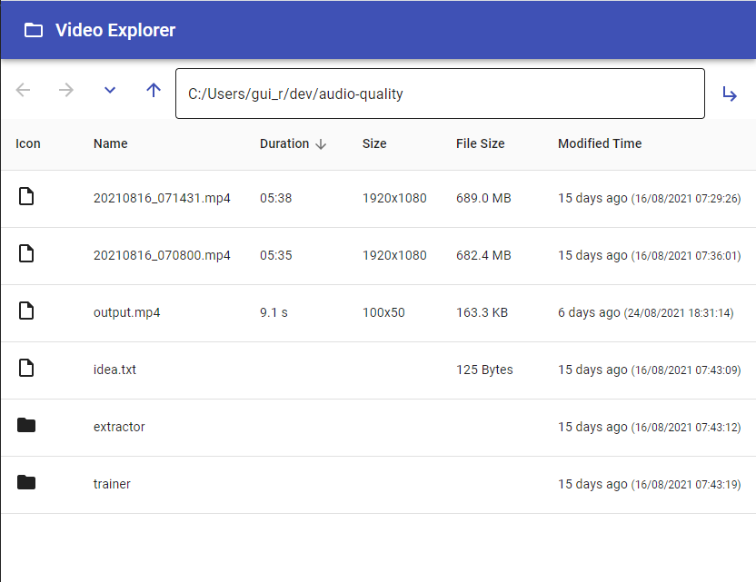

# Video Explorer

A ReactJS application to browse the host file system that shows metadata about video such as duration and size.



# How to run

You must have [NodeJS](https://nodejs.org/), npm and [ffmpeg](https://www.ffmpeg.org/) installed

```
git clone ...
cd video-explorer-app
npm run start
```

# Technologies

 - ReactJS
 - Material Design
 - ExpressJS

# License

MIT
